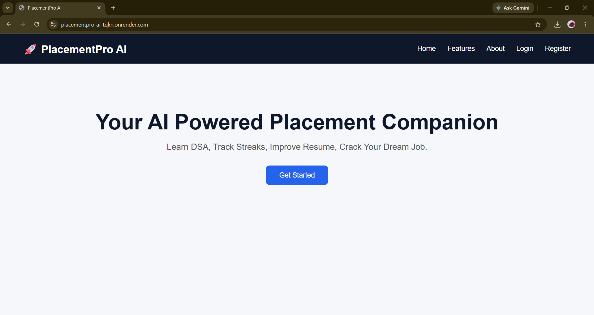
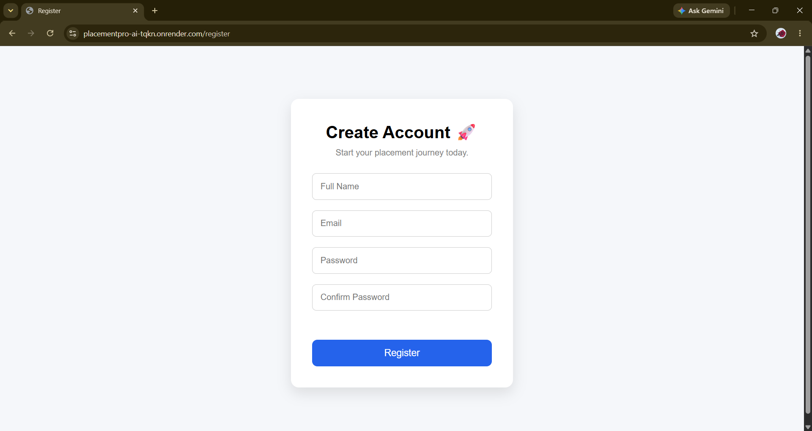
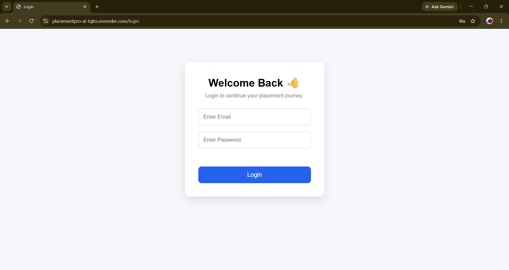
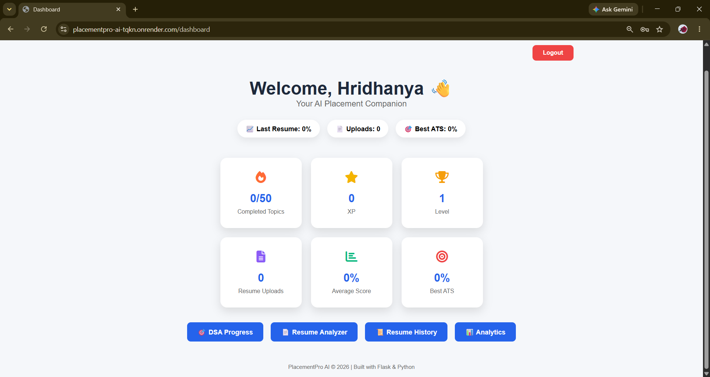
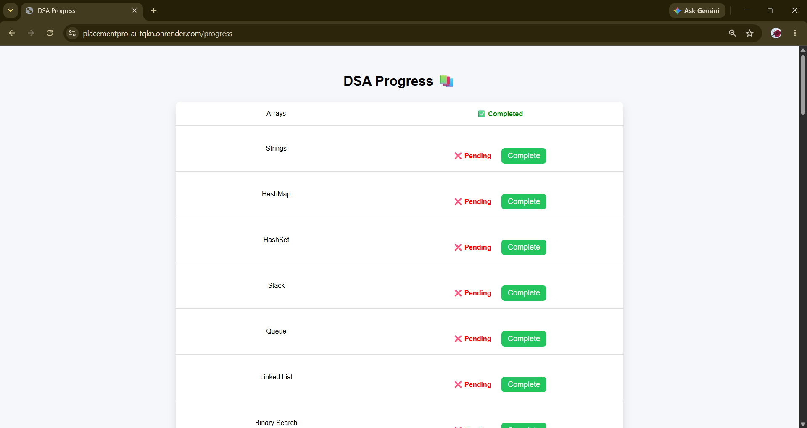
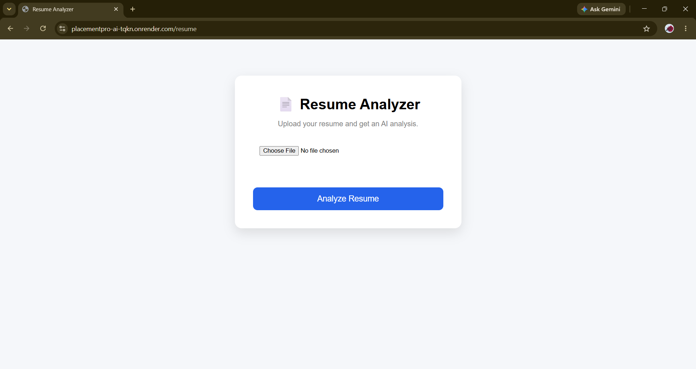
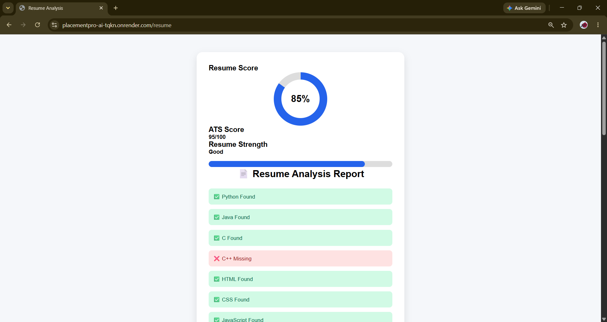
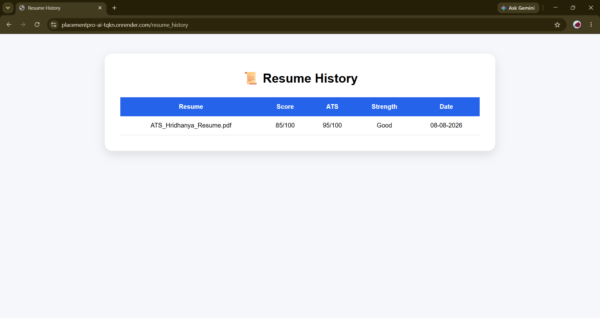
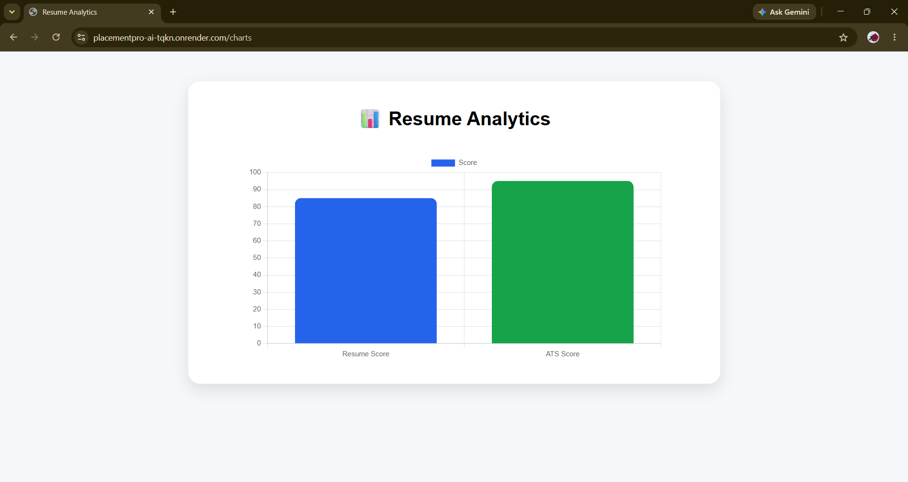

# 🚀 PlacementPro AI

A Flask-based **AI-Powered Placement Preparation Platform** that helps students prepare for placements through resume analysis, ATS scoring, DSA progress tracking, resume history, and performance analytics.

---

## 🌐 Live Demo

🔗 https://placementpro-ai-tqkn.onrender.com/

---

# 📖 Project Overview

PlacementPro AI is a web application developed to support students during their placement preparation. The platform provides a centralized dashboard where users can track DSA preparation, analyze resumes, evaluate ATS scores, view resume history, and monitor their placement readiness.

The application uses **Flask** for backend development, **PostgreSQL** for persistent data storage, and **PDF processing** for resume analysis.

---

# ✨ Features

## 👨‍🎓 Student Module

- Student Registration
- Secure Login
- Personalized Dashboard
- DSA Progress Tracking
- XP and Level System
- Resume PDF Upload
- Resume Score Analysis
- ATS Score Generation
- Resume Strength Evaluation
- Resume Improvement Suggestions
- Job Recommendations
- Resume History
- Analytics Dashboard
- Downloadable Resume Report

---

## 📄 Resume Analyzer

- Extracts text from PDF resumes
- Detects technical skills
- Checks important resume sections
- Checks GitHub profile
- Checks LinkedIn profile
- Generates Resume Score
- Generates ATS Score
- Provides improvement suggestions
- Recommends suitable job roles

---

## 📊 Dashboard

The dashboard displays:

- Completed DSA Topics
- XP
- Current Level
- Resume Upload Count
- Average Resume Score
- Best ATS Score

---

## 📚 DSA Progress Tracker

Users can track important DSA topics including:

- Arrays
- Strings
- HashMap
- Linked List
- Stack
- Queue
- Binary Search
- Sorting
- Two Pointers
- Sliding Window
- Trees
- Graphs
- Dynamic Programming
- Greedy
- SQL Basics
- And more

Completed topics contribute to the user's XP and level.

---

# 🛠 Tech Stack

| Category | Technologies |
|---|---|
| Frontend | HTML5, CSS3, JavaScript |
| Backend | Python, Flask |
| Database | PostgreSQL |
| ORM | Flask-SQLAlchemy |
| Resume Processing | PDFPlumber |
| PDF Reports | ReportLab |
| Charts | Chart.js |
| Authentication | Werkzeug |
| Deployment | Render |
| Version Control | Git & GitHub |

---

# 📂 Project Structure

```text
PlacementPro-AI/
│
├── static/
│   └── css/
│       ├── global.css
│       ├── dashboard.css
│       ├── progress.css
│       ├── resume.css
│       ├── analysis.css
│       ├── history.css
│       └── charts.css
│
├── templates/
│   ├── base.html
│   ├── index.html
│   ├── login.html
│   ├── register.html
│   ├── dashboard.html
│   ├── progress.html
│   ├── resume.html
│   ├── analysis.html
│   ├── resume_history.html
│   └── charts.html
│
├── app.py
├── models.py
├── requirements.txt
├── Procfile
├── .gitignore
└── README.md
```

---

# 🚀 Installation

## Clone the Repository

```bash
git clone https://github.com/Hridhanya-P/PlacementPro-AI.git
```

## Go to the Project Folder

```bash
cd PlacementPro-AI
```

## Install Dependencies

```bash
pip install -r requirements.txt
```

## Run the Application

```bash
python app.py
```

## Open in Browser

```text
http://127.0.0.1:5000/
```

---

# 🔐 Environment Variables

For local development, configure the following environment variables:

```text
SECRET_KEY=your_secret_key
DATABASE_URL=your_postgresql_database_url
```

> **Note:** Do not upload `.env` files or database credentials to GitHub.

---

# 📷 Screenshots

## 🏠 Landing Page



---

## 🔐 Student Login



---

## 📝 Student Registration



---

## 📊 Dashboard



---

## 📚 DSA Progress



---

## 📄 Resume Analyzer



---

## 📈 Resume Analysis



---

## 🕘 Resume History



---

## 📊 Resume Analytics



---

# 🔮 Future Enhancements

- AI-powered resume improvement
- AI mock interview system
- Job recommendations based on resume skills
- Resume comparison
- Advanced ATS keyword optimization
- Dark mode
- Detailed placement analytics
- Personalized placement preparation roadmap
- Email notifications

---

# 👩‍💻 Developer

**Hridhanya P**

Computer Science and Engineering Student

**GitHub:** https://github.com/Hridhanya-P

---

# 📄 License

This project is developed for educational, portfolio, and learning purposes.